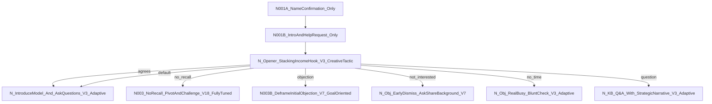
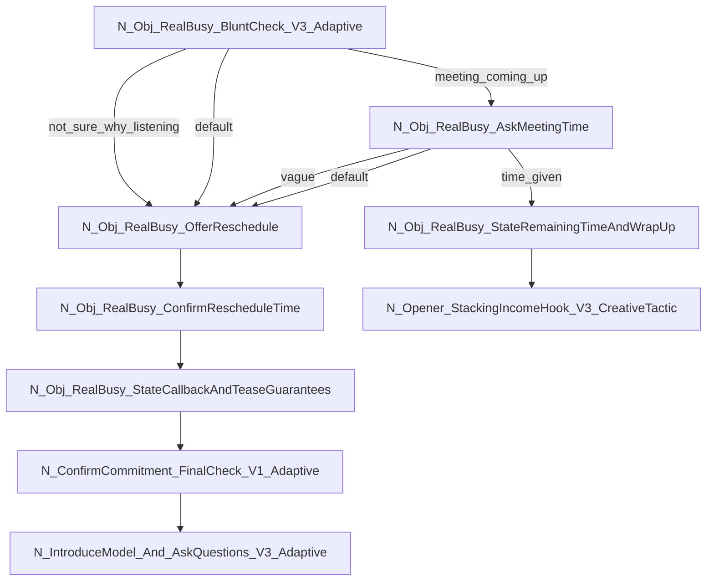
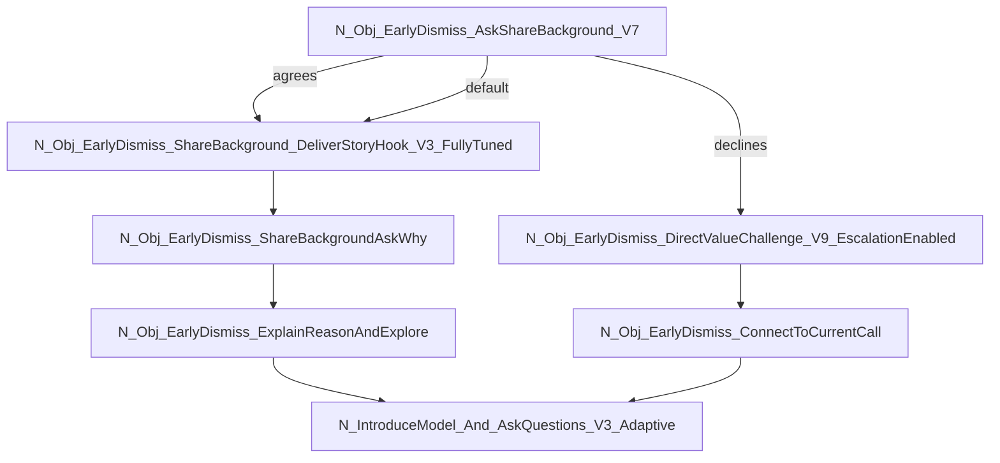
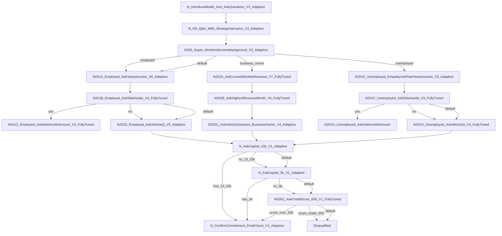
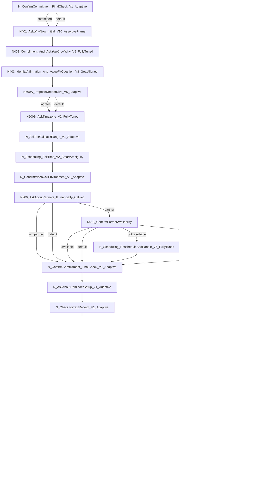

# Complete Conversation Flow

## Initial Nodes
1. N001A_NameConfirmation_Only
2. N001B_IntroAndHelpRequest_Only
3. N_Opener_StackingIncomeHook_V3_CreativeTactic

## Main Conversation Path

### Opening Sequence

### Objection Handling - Busy Prospects

### Objection Handling - Early Dismissal

### Qualification Process

### Closing Sequence

## Node Details

### Initial Nodes
1. **N001A_NameConfirmation_Only**
   - Goal: Say the person's name
   - Script: `{{customer_name}}?`

2. **N001B_IntroAndHelpRequest_Only**
   - Goal: Ask them if they could help you out
   - Script: "This is Jake. I was just, um, wondering if you could possibly help me out for a moment?"

3. **N_Opener_StackingIncomeHook_V3_CreativeTactic**
   - Goal: Introduce the agent and context, deliver the "stacking income without stacking hours" hook
   - Script: "Well, uh I don't know if you could yet, but, I'm calling because you filled out an ad about stacking income without stacking hours. I know this call is out of the blue, but do you have just 25 seconds for me to explain why I'm reaching out today specifically?"

3.1. **N_IntroduceModel_And_AskQuestions_V3_Adaptive_Dominant**
   - Goal: Deliver a concise, high-level summary of the business model (Dominant personality variant)
   - Script: "Okay. In a nutshell, we set up passive income websites that generate revenue with minimal ongoing effort. What's the biggest concern you have about this model?"

3.2. **N_IntroduceModel_And_AskQuestions_V3_Adaptive_Influential**
   - Goal: Deliver a concise, high-level summary of the business model (Influential personality variant)
   - Script: "Okay. In a nutshell, we set up passive income websites, and we let them produce income for you. Isn't that exciting? What aspects of this do you find most interesting?"

3.3. **N_IntroduceModel_And_AskQuestions_V3_Adaptive_Steady**
   - Goal: Deliver a concise, high-level summary of the business model (Steady personality variant)
   - Script: "Okay. In a nutshell, we set up passive income websites, and we let them produce income for you. Take your time to think about it. What questions come to mind as you consider this opportunity?"

3.4. **N_IntroduceModel_And_AskQuestions_V3_Adaptive_Conscientious**
   - Goal: Deliver a concise, high-level summary of the business model (Conscientious personality variant)
   - Script: "Okay. In a nutshell, we set up passive income websites, and we let them produce income for you. I can provide more detailed information about the process if you'd like. What specific aspects would you like to know more about?"

### Objection Handling Nodes
4. **N_Obj_RealBusy_BluntCheck_V3_Adaptive**
   - Goal: Diagnose whether the user's "I'm busy" objection is genuine or a dismissal
   - Script: "Let me be blunt. Are you not sure why you should be listening to this, or is there a meeting coming up for you right now?"

5. **N_Obj_EarlyDismiss_AskShareBackground_V7**
   - Goal: Acknowledge skepticism and request to share background
   - Script: "I understand the skepticism. I was skeptical too until I became a student myself. And I'm not just any student. Do you mind if I take 20 seconds to share a bit about my background?"

### Qualification Nodes
6. **N200_Super_WorkAndIncomeBackground_V3_Adaptive**
   - Goal: Determine employment status
   - Script: "Alright, love that! So, are you working for someone right now or do you run your own business?"

6.1. **N200_Super_WorkAndIncomeBackground_V3_Adaptive_Dominant**
   - Goal: Determine employment status (Dominant personality variant)
   - Script: "Great! So, are you currently employed or running your own business? I'm looking to understand your current situation so we can determine how this opportunity fits."

6.2. **N200_Super_WorkAndIncomeBackground_V3_Adaptive_Influential**
   - Goal: Determine employment status (Influential personality variant)
   - Script: "That's fantastic! So, are you working for someone right now or do you run your own business? I'd love to hear about your current situation!"

6.3. **N200_Super_WorkAndIncomeBackground_V3_Adaptive_Steady**
   - Goal: Determine employment status (Steady personality variant)
   - Script: "I'm glad you're enjoying this! So, are you working for someone right now or do you run your own business? Take your time to think about it."

6.4. **N200_Super_WorkAndIncomeBackground_V3_Adaptive_Conscientious**
   - Goal: Determine employment status (Conscientious personality variant)
   - Script: "That's wonderful! So, are you working for someone right now or do you run your own business? I'm interested in understanding your current professional situation."

7. **N_AskCapital_15k_V1_Adaptive**
   - Goal: Ask about liquid capital
   - Script: "Okay, got it. For this kind of business, it definitely helps to have about fifteen to twenty-five thousand dollars in liquid capital set aside for initial expenses. Is that what you'd generally have on hand, moneywise?"

### Closing Nodes
8. **N500A_ProposeDeeperDive_V5_Adaptive**
   - Goal: Propose scheduling a deeper dive call
   - Script: "Okay, that's excellent. I definitely feel like we can help you with that. What we need to do is set up another call that'll be a deeper dive into your situation. Sound good?"

9. **N_EndCall_Final_V2_Decisive**
   - Goal: Deliver final closing statement
   - Script: "Okay, perfect. You are all set then, {{customer_name}}. I've just sent that confirmation email over to you. Have a great rest of your day. Goodbye."

10. **N_KB_Q&A_With_StrategicNarrative_V3_Adaptive**
   - Goal: Dynamically answer the user's questions using the `qualifier setter` KB, ensure the core income potential has been discussed, and then deliver the "$20k" value-framing question.
   - Script: "I understand you have questions, and I'm happy to address them. Based on what you've told me, I can see how this opportunity might be a good fit for you. Many of our students have been able to generate significant income - we've seen people make anywhere from an extra $20,000 to over a million dollars per month. Now, I'm curious - what aspects of this opportunity are you most interested in learning more about?"