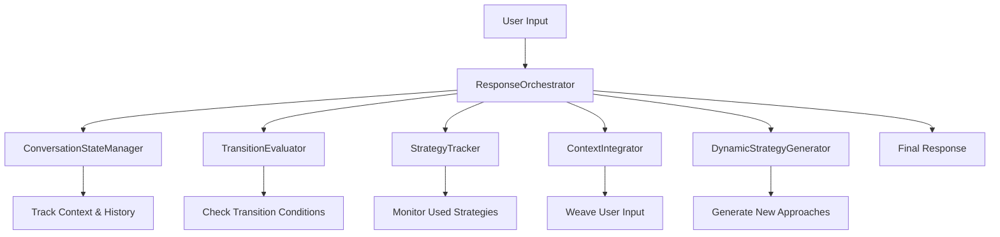

# AI Phone Setter Conversation Flow Architecture

## Problem Summary
The current AI phone setter system has critical issues with natural conversation flow:
1. **Repetition**: Using the same objection handlers multiple times
2. **Context Loss**: Not incorporating user statements when transitioning between nodes
3. **Poor Strategy Variation**: Minor synonym changes instead of fundamentally different approaches
4. **Dead-End Responses**: Ending without clear next steps or questions
5. **Flow Disruption**: Not properly checking transition conditions before moving forward

## Solution Architecture

### Core Components

### Key Design Principles

1. **Strategy Tracking**: Every objection handler used is tracked globally to prevent repetition
2. **Transition Awareness**: System knows when specific responses are needed vs. when it can move forward
3. **Context Integration**: User statements are naturally incorporated, not ignored
4. **Dynamic Generation**: Each re-attempt uses fundamentally different persuasion strategies
5. **Natural Flow**: Responses always end with questions that guide toward transition conditions

### Strategy Variation Examples

For the goal: "Get user to express interest in $20k/month"

**First Attempt** (Direct Value):
"It's pretty simple, we rank websites for local businesses and bank the passive income. Would you be upset with an extra $20k a month?"

**Second Attempt** (Impact Focus):
"I hear your concern. Let me ask you this - how would your life change if you had an extra $20k coming in every month without working more hours?"

**Third Attempt** (Social Proof):
"I get the skepticism. We've helped over 7,500 people hit this mark. What would need to be true for you to believe this could work for you too?"

### Context Integration Examples

**User says**: "Yeah sure, but I don't know too much about the company."

**Bad (Robotic)**: "Gotcha, do you work for someone right now or do you own your own business?"

**Good (Natural)**: "We've been in business for over 10 years, but I'm curious - do you work for someone right now or do you own your own business?"

**Good (Alternative)**: "Fair point, we can cover that. Quick question though - are you currently employed or running your own business?"

### Implementation Priority

**Phase 1: Core Infrastructure**
- ConversationStateManager
- StrategyTracker
- TransitionEvaluator

**Phase 2: Response Generation**
- DynamicStrategyGenerator
- ContextIntegrator
- Enhanced PromptBuilder

**Phase 3: Orchestration**
- ResponseOrchestrator
- Integration with caller_agent.py
- Configuration updates

**Phase 4: Testing & Refinement**
- Unit tests
- Integration tests
- Real conversation testing

This architecture ensures the AI phone setter behaves like a skilled human sales agent who:
- Remembers what they've already tried
- Adapts their approach based on responses
- Maintains natural conversation flow
- Always works toward the goal while respecting the prospect's input